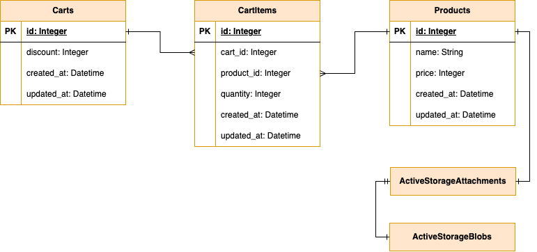

# CLEANSTONE

Тестовое задание мини-приложение со страницей корзины покупок для интернет-магазина [cсылка на дизайн](https://www.figma.com/file/7WlRpc5VxNpkgtusKxHgbM/CLEANSTON-Rails-challenge?type=design&node-id=0%3A1&mode=design&t=jZmlNKueZZ2mKE6a-1)

## ER-диаграмма



## Установка

Установите гемы

```
bundle install
```

## Запуск

Создайте базу данных

```
rails db:create
rails db:migrate
```

Заполните базу данных тестовыми данными:

```
rails db:seed
```

Запустите приложения командой:

```
bin/dev
```